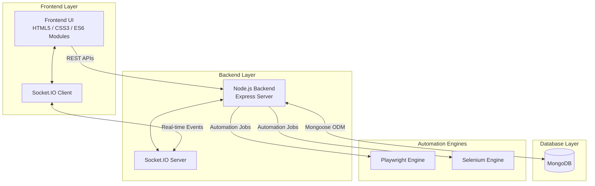

# BugOS 🐞

**BugOS** is a comprehensive, real-time Bug Tracking and Test Case Management platform designed to streamline software quality assurance workflows. It combines bug tracking, test case management, evidence collection, real-time collaboration, and automation execution into a single centralized dashboard.

Developed to simplify QA operations, BugOS enables testers and developers to collaborate efficiently while maintaining complete visibility across the software testing lifecycle.


---

## 🚀 Project Highlights

* Real-time collaboration using Socket.IO
* Centralized bug tracking and management
* Comprehensive test case management system
* Playwright automation execution
* Selenium automation execution
* Screenshot and evidence management
* Live execution logs and reporting
* Dockerized deployment architecture
* MongoDB-backed persistence layer
* Modular frontend architecture using ES6 modules

---

## ✨ Features

### 🔄 Real-Time Collaboration

BugOS uses Socket.IO to synchronize updates instantly across connected users. Bug status changes, test case updates, and execution results are reflected in real time without requiring page refreshes.

### 🐞 Bug Management

* Create and manage software defects
* Track bug lifecycle from creation to resolution
* Assign severity and priority levels
* Maintain evidence and supporting documentation
* Monitor module-wise bug distribution

### 🧪 Test Case Management

* Create and organize test cases
* Import and export test repositories
* Categorize test cases by module
* Track execution status
* Link bugs directly to related test cases

### ⚙️ Automation Execution Engine

Execute automated tests directly from the platform.

Supported frameworks:

* Playwright
* Selenium

Capabilities:

* Browser-based script editing
* Execution monitoring
* Real-time logs
* Result tracking

### 📷 Evidence Management

* Upload screenshots for bug reports
* Store supporting artifacts
* Image preview support
* Centralized evidence repository

### 📊 Dynamic Dashboards

Visualize:

* Bug severity distribution
* Test execution metrics
* Module health
* QA progress
* Testing coverage

---

## 🏗️ System Architecture



---

## 💻 Tech Stack

### Frontend

* HTML5
* CSS3
* Vanilla JavaScript (ES6 Modules)

### Backend

* Node.js
* Express.js

### Database

* MongoDB
* Mongoose

### Real-Time Communication

* Socket.IO

### Automation

* Playwright
* Selenium

### Editor

* CodeMirror 6

### DevOps

* Docker
* Docker Compose

---

## ⚙️ Setup & Installation

### Option 1: Docker (Recommended)

The easiest way to get BugOS running is via Docker, which automatically provisions both the Node application and MongoDB.

1. Clone the repository.
2. Run the following command:
   ```bash
   docker-compose up --build
   ```
3. Access the application at `http://localhost:3000`.

### Option 2: Manual Local Setup

1. Ensure **Node.js** (v16+) and **MongoDB** are installed on your machine.
2. Clone the repository and install dependencies:
   ```bash
   npm install
   ```
3. Start your local MongoDB server (or run `dev_tools/start-mongo.bat` if available).
4. Start the application:
   ```bash
   npm start
   ```
5. Navigate to `http://localhost:3000` in your browser.

---

Application will be available at:

```text
https://www.bugos.app/
```

---

## 🧪 Automation Features

### Playwright Integration

* Browser automation execution
* Screenshot generation
* Automated testing workflows
* Execution result tracking

### Selenium Integration

* Web automation support
* Cross-browser testing
* Script execution from dashboard
* Real-time execution logs

### Live Logs

Execution logs are streamed back to the frontend using WebSockets for immediate visibility.

---

## 🎯 Why BugOS?

Most bug tracking tools focus solely on issue management, while automation platforms focus only on test execution.

BugOS bridges both worlds by providing:

* Bug Tracking
* Test Case Management
* Automation Execution
* Evidence Collection
* Real-Time Collaboration

inside a single unified platform.

---

## 👨‍💻 Author

**Anmol Shrivastava**

GitHub: https://github.com/anmolshrivastavaa

---
