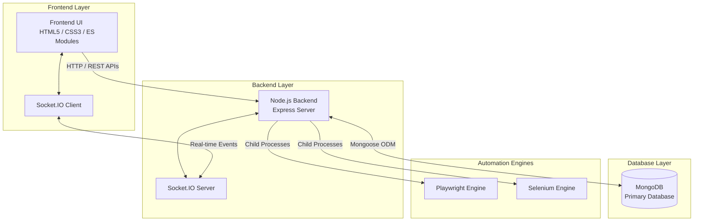

# BugOS 🐞

**BugOS** is a comprehensive, real-time Bug Tracking and Test Case Management platform designed for modern software teams. It provides a centralized dashboard to track software defects, map them directly to test cases, execute automated tests, and seamlessly manage QA workflows.


## 🚀 Features

- **Real-Time Collaboration**: Powered by WebSockets to ensure all team members see bug updates and test case changes instantly.
- **Test Case Management**: Import, export, and maintain thousands of test cases, linking them to specific modules and execution states.
- **Bug Escalation Workflows**: Track bugs from discovery to resolution with built-in escalation matrices for backend intervention.
- **Automation Execution Engine**: Write and execute automated scripts (Playwright, Selenium) directly in the browser via an embedded CodeMirror editor.
- **Evidence Management**: Upload screenshots and logs as evidence for bug reports, complete with image preview modals.
- **Dynamic Dashboards**: Visualize module health, bug severity distribution, and test case coverage with responsive SVGs and data cards.

---

## 🏗️ Architecture

BugOS uses a decoupled architecture allowing a lightweight frontend to communicate asynchronously with a robust Node.js backend.



---

## 💻 Tech Stack

- **Frontend**: Vanilla JavaScript (ES6+ Modules), HTML5, CSS3
- **Backend**: Node.js, Express.js
- **Database**: MongoDB (via Mongoose)
- **Real-time**: Socket.IO
- **Automation Integration**: Playwright, Selenium
- **Code Editor**: CodeMirror 6

---

## 📁 Folder Structure

The repository is modular and organized for scalability:

```text
BugOS/
├── public/                 # Static assets served to the client
│   ├── css/                # Component-based stylesheets (main.css, dashboard.css, etc.)
│   ├── js/                 # ES6 Module JavaScript (api.js, bugs.js, state.js, etc.)
│   ├── assets/             # Images and SVG icons
│   └── index.html          # Main application entry point
├── server.js               # Node.js / Express backend entry point
├── docker-compose.yml      # Container orchestration
├── Dockerfile              # Docker image specification
└── package.json            # Dependencies and scripts
```

---

## ⚙️ Setup & Installation

### Option 1: Docker (Recommended)

The easiest way to get BugOS running is via Docker, which automatically provisions both the Node application and MongoDB.

1. Clone the repository.
2. Run the following command:
   ```bash
   docker-compose up --build
   ```
3. Access the application at `http://localhost:3000`.

### Option 2: Manual Local Setup

1. Ensure **Node.js** (v16+) and **MongoDB** are installed on your machine.
2. Clone the repository and install dependencies:
   ```bash
   npm install
   ```
3. Start your local MongoDB server (or run `dev_tools/start-mongo.bat` if available).
4. Start the application:
   ```bash
   npm start
   ```
5. Navigate to `http://localhost:3000` in your browser.

---

## 🧪 Automation Features

BugOS goes beyond standard bug tracking by embedding a **Live Automation Engine**:
- **Syntax Highlighting**: Built-in CodeMirror editor supports JavaScript and Python.
- **Execution**: Trigger Playwright or Selenium scripts directly from the UI.
- **Logs**: View real-time console output and execution results streamed back via WebSockets.

---
*Developed with a focus on code quality, modularity, and seamless user experience.*
